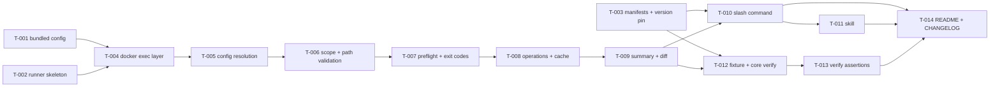

# Build Site

14 tasks across 10 tiers from 2 kits.

Target stack: POSIX-ish bash runner + Docker (`ghcr.io/php-cs-fixer/php-cs-fixer:3.95.25-php8.5`) + Claude Code plugin (`.claude-plugin/` manifest, marketplace-in-repo, `commands/`, `skills/`). No host PHP/composer — every PHP execution happens inside the pinned image; output parsing is host-side bash/awk.

Host reality for builders: Arch Linux, Docker 29.7, image already pulled, uid:gid 1000:1000, no `php`/`composer` on PATH. macOS-only criteria (runner R3.4, plugin R1.2 macOS half) are **verified by inspection; runtime check deferred to a macOS machine**.

## Tier 0 — No Dependencies (Start Here)
| Task | Title | Cavekit | Requirement | Effort |
|---|---|---|---|---|
| T-001 | Bundled default php-cs-fixer config | cavekit-runner.md | R4 | S |
| T-002 | Runner skeleton: CLI contract, project root, exit codes | cavekit-runner.md | R2, R6, R8 | M |
| T-003 | Plugin manifest, marketplace, version↔image pin | cavekit-plugin.md | R6 | S |

## Tier 1 — Depends on Tier 0
| Task | Title | Cavekit | Requirement | blockedBy | Effort |
|---|---|---|---|---|---|
| T-004 | Docker execution layer: pinned image, mount, workdir, uid/gid | cavekit-runner.md | R1, R2, R3 | T-001, T-002 | M |

## Tier 2 — Depends on Tier 1
| Task | Title | Cavekit | Requirement | blockedBy | Effort |
|---|---|---|---|---|---|
| T-005 | Config resolution: project config precedence vs bundled default | cavekit-runner.md | R4 | T-004 | M |

## Tier 3 — Depends on Tier 2
| Task | Title | Cavekit | Requirement | blockedBy | Effort |
|---|---|---|---|---|---|
| T-006 | Scope resolution and path validation | cavekit-runner.md | R7 | T-005 | M |

## Tier 4 — Depends on Tier 3
| Task | Title | Cavekit | Requirement | blockedBy | Effort |
|---|---|---|---|---|---|
| T-007 | Preflight chain and exit-status classes | cavekit-runner.md | R8, R5, R7 | T-006 | M |

## Tier 5 — Depends on Tier 4
| Task | Title | Cavekit | Requirement | blockedBy | Effort |
|---|---|---|---|---|---|
| T-008 | Operations: fix, check, flag pass-through, cache, tool-error passthrough | cavekit-runner.md | R6, R5 | T-007 | M |

## Tier 6 — Depends on Tier 5
| Task | Title | Cavekit | Requirement | blockedBy | Effort |
|---|---|---|---|---|---|
| T-009 | Agent-friendly summary and diff delimiter | cavekit-runner.md | R9 | T-008 | M |

## Tier 7 — Depends on Tier 6
| Task | Title | Cavekit | Requirement | blockedBy | Effort |
|---|---|---|---|---|---|
| T-010 | Slash command mapping 1:1 to runner | cavekit-plugin.md | R2, R1, R4, R5 | T-003, T-009 | M |
| T-012 | Fixture and core verification script | cavekit-plugin.md | R7, R4 | T-003, T-009 | M |

## Tier 8 — Depends on Tier 7
| Task | Title | Cavekit | Requirement | blockedBy | Effort |
|---|---|---|---|---|---|
| T-011 | Skill: triggers and do-not list | cavekit-plugin.md | R3 | T-010 | S |
| T-013 | Verification script: environment, ownership, precedence, version assertions | cavekit-plugin.md | R6, R4, R5 | T-012 | M |

## Tier 9 — Depends on Tier 8
| Task | Title | Cavekit | Requirement | blockedBy | Effort |
|---|---|---|---|---|---|
| T-014 | README, CHANGELOG, install and release documentation | cavekit-plugin.md | R1, R6 | T-010, T-011, T-013 | S |

## Task Details

### T-001: Bundled default php-cs-fixer config
**Kit/Req:** cavekit-runner.md R4
**Covers criteria:** R4.3
**blockedBy:** none
**Effort:** S
**Files:** `config/default.php-cs-fixer.php`
**Description:**
Write the bundled default configuration that applies when a project has no config of its own. Return a `PhpCsFixer\Config` with:
- `->setRules(['@Symfony' => true, 'array_syntax' => ['syntax' => 'short']])`
- `->setRiskyAllowed(false)` — explicitly, so `declare_strict_types` and every other risky rule stays off even if a caller passes `--allow-risky=yes` without intending it. (Caller-supplied `--allow-risky=yes` still reaches php-cs-fixer per R6.4; the config's own default must be false.)
- `->setFinder(PhpCsFixer\Finder::create()->in(getcwd()))` — **use `getcwd()`, never `__DIR__`**: this file is mounted at a fixed container path (`/cavekit/default.php-cs-fixer.php`), outside the project, so `__DIR__` would point at the mount, not at `P`. `getcwd()` is `P` because the container workdir is `P` (T-004).
- Do not set a cache file path; php-cs-fixer's default `.php-cs-fixer.cache` in the workdir is what R6.5 requires.
Add a header comment stating the file is mounted read-only and must not assume it lives inside the project.
**Verification the builder must run:** none behavioural at this tier (no runner yet). Lint the file inside the image: `docker run --rm -v "$PWD/config:/c:ro" --entrypoint php ghcr.io/php-cs-fixer/php-cs-fixer:3.95.25-php8.5 -l /c/default.php-cs-fixer.php`. Behavioural proof of R4.3 lands in T-005.
**Done when:**
- Config enables `@Symfony`, sets short array syntax, and sets `setRiskyAllowed(false)`.
- No `__DIR__` usage; finder is rooted at `getcwd()`.
- `php -l` inside the pinned image reports no syntax error.

### T-002: Runner skeleton: CLI contract, project root, exit codes
**Kit/Req:** cavekit-runner.md R2, R6, R8
**Covers criteria:** R2.1, R2.5, R6.4 (argument surface), R8.4 (status constants)
**blockedBy:** none
**Effort:** M
**Files:** `bin/php-cs-fixer-docker`
**Description:**
Create the executable runner script (`#!/usr/bin/env bash`, `set -u`; do **not** use `set -e` — exit statuses of php-cs-fixer must be captured deliberately). Implement only the frame in this task:
- Usage: `php-cs-fixer-docker <check|fix> [paths...] [-- extra php-cs-fixer flags]`. Unknown or missing operation → usage on stderr, tool-error exit.
- Argument parsing: first positional is the operation; subsequent positionals are paths until a literal `--`; everything after `--` is an opaque array of php-cs-fixer flags forwarded verbatim (no interpretation, no reordering, no de-duplication).
- Exit-status constants, defined once at the top and used everywhere: `EXIT_OK=0`, `EXIT_VIOLATIONS=1`, `EXIT_TOOL_ERROR=2`. Decision to implement and document: php-cs-fixer's own dry-run violation status (8, and bitmask combinations containing 8) is **mapped** to `EXIT_VIOLATIONS=1`; every other non-zero php-cs-fixer status (4, 16, 32, …) maps to `EXIT_TOOL_ERROR=2`. Write this mapping as a small `map_fixer_status()` function now, even though it is only called from T-008.
- Project root resolution `resolve_project_root()`: `git rev-parse --show-toplevel` run from `$PWD`; on success `P` is its output; on failure (non-zero status, i.e. not inside a repo) `P="$PWD"`. Normalize with `cd -- "$P" && pwd -P` so `P` is absolute and symlink-resolved, and record whether the run is inside a repo in a flag variable (`IN_GIT_REPO=0|1`) used by T-006/T-007.
- Everything else (docker, config, scope, output) is a stub function with a `TODO` comment, so later tasks extend rather than restructure.
**Verification the builder must run:** `bash -n bin/php-cs-fixer-docker`; `shellcheck bin/php-cs-fixer-docker` if available; manual checks that `P` is identical when the script is invoked from the repo root and from a nested subdirectory (echo `P` behind a debug flag or a temporary `--print-root` hidden switch removed before the task is done), and that outside any git repo `P` equals `$PWD` (test in a `mktemp -d` outside the repo).
**Done when:**
- Inside a repo, invoking from the root and from a subdirectory prints the same `P`, equal to `git rev-parse --show-toplevel`.
- Outside a repo, `P` equals the invoking working directory.
- `script check a.php b.php -- --verbose --rules=@PSR12` parses to operation `check`, paths `[a.php b.php]`, passthrough `[--verbose --rules=@PSR12]`.
- Three distinct exit constants exist in one place and no literal exit numbers are scattered through the script.

### T-003: Plugin manifest, marketplace, version↔image pin
**Kit/Req:** cavekit-plugin.md R6
**Covers criteria:** pR6.1, pR6.2
**blockedBy:** none
**Effort:** S
**Files:** `.claude-plugin/plugin.json`, `.claude-plugin/marketplace.json`, `CHANGELOG.md` (created here with the VERSION↔IMAGE mapping block)
**Description:**
- `.claude-plugin/plugin.json`: `{"name":"php-cs-fixer","version":"1.0.0","description":…,"author":{"name":"alecszaharia"},"homepage"/"repository":"https://github.com/alecszaharia/claude-php-cs-fixer","license":…,"keywords":["php","php-cs-fixer","formatting","docker"]}`. `version` must be explicit — without it the plugin version is the git SHA and pR6.1/pR6.2 cannot hold.
- `.claude-plugin/marketplace.json`: `{"name":"claude-php-cs-fixer","owner":{"name":"alecszaharia"},"plugins":[{"name":"php-cs-fixer","source":"./","description":…,"version":"1.0.0"}]}`. `source` is relative to the marketplace directory (repo root).
- `CHANGELOG.md`: create with a machine-greppable mapping block that the T-013 assertion parses, one line per released version, exact format:
  `- 1.0.0: ghcr.io/php-cs-fixer/php-cs-fixer:3.95.25-php8.5`
  under a heading `## VERSION-IMAGE mapping`, plus a normal `## 1.0.0` release entry. This block, not prose, is the contract between plugin version and pinned tag.
**Verification the builder must run:** both JSON files parse (`node -e 'JSON.parse(require("fs").readFileSync(process.argv[1],"utf8"))' <file>` — node is present on this host); plugin `name`/`version` in plugin.json and marketplace.json agree; the CHANGELOG mapping line for 1.0.0 contains exactly the tag that T-004 pins.
**Done when:**
- Both manifests are valid JSON with the names and version fixed above.
- CHANGELOG contains a `## VERSION-IMAGE mapping` block with `1.0.0` mapped to one image reference.
- Exactly one image reference is recorded for version 1.0.0 (no second candidate tag anywhere in the mapping block).

### T-004: Docker execution layer: pinned image, mount, workdir, uid/gid
**Kit/Req:** cavekit-runner.md R1, R2, R3
**Covers criteria:** R1.1, R1.2, R1.3, R1.4, R2.2, R2.3, R2.4, R3.1, R3.2, R3.3, R3.4
**blockedBy:** T-001, T-002
**Effort:** M
**Files:** `bin/php-cs-fixer-docker`
**Description:**
Implement `run_fixer()`, the single place that starts a container.
- One image constant at the top of the runner and nowhere else: `IMAGE="ghcr.io/php-cs-fixer/php-cs-fixer:3.95.25-php8.5"`. Explicit tag, never `latest`. `grep -c 'ghcr.io/php-cs-fixer' bin/php-cs-fixer-docker` must be 1.
- Mount fidelity: `-v "$P:$P" -w "$P"` — identical absolute path inside and outside, so `__DIR__`, `vendor/autoload.php` and every path in php-cs-fixer's output are host-valid without rewriting.
- Read-only sidecar mount at a fixed container path outside `P`: `-v "$RUNNER_ROOT/config/default.php-cs-fixer.php:/cavekit/default.php-cs-fixer.php:ro"`, where `RUNNER_ROOT` is derived from `${BASH_SOURCE[0]}` (`cd "$(dirname "${BASH_SOURCE[0]}")/.." && pwd -P`) so the runner works from any cwd and from the installed plugin directory.
- Ownership: on `uname -s` = `Linux`, add `--user "$(id -u):$(id -g)"`; on `Darwin`, add nothing (Docker Desktop's default mapping already preserves ownership). Any other `uname` → treat as Linux-style only if `id -u` works, otherwise tool error.
- Always `--rm`, `-i` only if needed, never `-t` (no TTY — output must be parseable and prompt-free), and `-e HOME=/tmp` so php-cs-fixer never tries to write into a non-existent home for the mapped uid.
- Use the image's default entrypoint (php-cs-fixer itself); pass `fix ...` as the command. Do not override the entrypoint. Capture container stdout+stderr to a host temp file (`mktemp`) and the exit status separately; T-009 parses that file on the host. No PHP code lives in this repo other than the bundled config.
**Verification the builder must run (Linux host, no host php):**
- `command -v php composer php-cs-fixer` returns nothing, yet a smoke run against a throwaway PHP file both in dry-run and rewrite mode completes.
- Run twice, assert the resolved image reference is byte-identical (echo it behind a debug flag or assert via `grep`).
- Rewrite a file, then `stat -c '%u:%g' <file>` equals `id -u`:`id -g`; `find "$P" -user root` is empty after the run.
- A temporary config that does `file_exists(__DIR__.'/marker')` resolves under `P`.
- macOS: **verify by inspection; runtime check deferred to a macOS machine** — confirm by reading the code that the `Darwin` branch adds no `--user` flag and takes the same code path otherwise.
**Done when:**
- Image reference appears exactly once in the runner, carries an explicit version tag, and is stable across consecutive runs.
- A fix and a check run both complete on a host with no php/composer/php-cs-fixer.
- Container workdir is `P` and project contents are visible there; `__DIR__` in a project config resolves under `P`.
- Paths in output resolve on the host (no container-internal alias appears).
- On Linux, rewritten and newly created files (including `.php-cs-fixer.cache`) are owned by the invoker; nothing is left root-owned.
- The `Darwin` branch is uid-override free (inspection).

### T-005: Config resolution: project config precedence vs bundled default
**Kit/Req:** cavekit-runner.md R4
**Covers criteria:** R4.1, R4.2, R4.3, R4.4
**blockedBy:** T-004
**Effort:** M
**Files:** `bin/php-cs-fixer-docker`
**Description:**
Implement `resolve_config()` returning two values: the php-cs-fixer argument to add, and the human label used by the summary (`config:` line, T-009).
- If `$P/.php-cs-fixer.php` exists → use php-cs-fixer's own discovery (pass **no** `--config`; php-cs-fixer picks it up from the workdir) and label `config: project ($P/.php-cs-fixer.php)`.
- Else if `$P/.php-cs-fixer.dist.php` exists → same, label `config: project ($P/.php-cs-fixer.dist.php)`.
- Else → add `--config=/cavekit/default.php-cs-fixer.php` and label `config: bundled default (@Symfony, non-risky, short arrays)`.
  Rationale for not passing `--config` in the project cases: php-cs-fixer's own precedence (`.php-cs-fixer.php` beats `.php-cs-fixer.dist.php`) is then authoritative and cannot drift from the runner's copy of the rule; the runner only *detects* which one php-cs-fixer will use in order to label it. The detection order must mirror php-cs-fixer's, and a comment must say so.
- Note the interaction with explicit paths: keep php-cs-fixer's default path mode (`override`) so explicit path arguments win over the config's Finder (needed by R7.3). Do not pass `--path-mode=intersection`.
- Emit the label through the not-yet-final summary stub so R4.4 is observable now and is reused verbatim by T-009.
**Verification the builder must run:** three temp projects under `/tmp` (git-init'd so scope resolution is trivial): (a) both config files present → output names `.php-cs-fixer.php`; (b) only `.dist.php` → output names it; (c) neither → bundled label, and a fixture containing `array(1,2)` plus no `declare(strict_types=1)` is rewritten to `[1, 2]` while **no** `declare` line is added.
**Done when:**
- `.php-cs-fixer.php` wins when both exist.
- `.php-cs-fixer.dist.php` is used when it is the only one.
- With neither, `@Symfony` + short arrays apply and no risky rule fires (long array rewritten; no `declare(strict_types=1)` inserted).
- Every run prints a `config:` line that distinguishes a project config (with its absolute path) from the bundled default.

### T-006: Scope resolution and path validation
**Kit/Req:** cavekit-runner.md R7
**Covers criteria:** R7.1, R7.2, R7.3, R7.4, R7.5, R7.6
**blockedBy:** T-005
**Effort:** M
**Files:** `bin/php-cs-fixer-docker`
**Description:**
Implement `resolve_scope()` producing an array of absolute paths (or an explicit "empty scope" signal).
- Explicit paths given: for each, reject before any container starts if it does not exist, or if its resolved absolute path is not `P` and does not start with `$P/`. Message must name the offending path, e.g. `error: path is outside the project root: /etc/passwd` and `error: path does not exist: src/Nope.php`; exit `EXIT_TOOL_ERROR`. Resolve each path with `cd`/`pwd -P` style normalization (no `realpath` dependency — it is absent on stock macOS) and compare against `$P` with a trailing-slash-safe prefix test. Accepted explicit paths are passed through as given regardless of git status, including unchanged tracked files and directories.
- No explicit paths and `IN_GIT_REPO=1`: default scope is the git working set, `.php` only. Use `git -c core.quotePath=false -C "$P" status --porcelain -z -uall` and parse NUL-delimited records: skip deleted entries (`D` in either status column with no surviving worktree path), take the destination side of renames (`R`/`C` records carry two NUL-separated fields), keep modified, staged, and untracked. Filter to names ending in `.php` (case-sensitive suffix match). Prefix each with `$P/`. `-uall` is required so untracked files inside untracked directories are listed individually; `-z` is required so paths with spaces or non-ASCII survive.
- No explicit paths and `IN_GIT_REPO=0`: this is the **same** condition and the **same** message as the R8 "no scope" preflight cause — a single string constant used by both, e.g. `error: no scope: not inside a git repository and no path given; pass a path`. Exit `EXIT_TOOL_ERROR`, no container started.
- Git repo, empty `.php` working set: not an error. Signal empty scope; the run must exit `EXIT_OK` and (T-009) print the zero-count summary. No container is started in this case.
**Verification the builder must run:** temp git repo with one modified `.php`, one staged `.php`, one untracked `.php`, one untracked `.txt`, one unchanged tracked `.php`, one file named with a space: default scope equals exactly the four `.php` working-set files; the `.txt` and the unchanged tracked file are absent. Explicit directory argument processes the unchanged tracked file. `script check /etc` and `script check does-not-exist.php` both fail with the naming message and status 2. Clean repo with no path exits 0. Non-repo temp dir with no path prints the shared no-scope message, status 2.
**Done when:**
- Default scope in a repo equals exactly the modified + staged + untracked `.php` files; unchanged tracked `.php` files are excluded.
- Non-`.php` working-set entries are excluded.
- Explicit files and directories under `P` are processed as given regardless of git status.
- Non-existent or out-of-root explicit paths are rejected before any php-cs-fixer work, message names the path, exit non-zero.
- Outside git with no path: no php-cs-fixer work, message asking for a path, non-zero — same constant as the preflight no-scope cause.
- Repo with empty working set and no path: exit 0 and reports nothing to process.

### T-007: Preflight chain and exit-status classes
**Kit/Req:** cavekit-runner.md R8, R5, R7
**Covers criteria:** R8.1, R8.2, R8.3, R8.4, R5.4, R7.5
**blockedBy:** T-006
**Effort:** M
**Files:** `bin/php-cs-fixer-docker`
**Description:**
Implement `preflight()` executed before any container start, in this fixed order, each failure a single line on stderr and `exit "$EXIT_TOOL_ERROR"`:
1. Docker CLI on PATH — `command -v docker` → `error: docker CLI not found on PATH; install Docker`
2. Daemon reachable — `docker info >/dev/null 2>&1` → `error: cannot reach the Docker daemon; is it running?`
3. Scope resolution (T-006), including the shared no-scope message.
4. Explicit path validation (T-006).
5. Image present or pullable — `docker image inspect "$IMAGE" >/dev/null 2>&1` else `docker pull "$IMAGE"`; on pull failure → `error: failed to pull image <IMAGE>` (distinct from both docker-CLI and daemon messages; include the pull's own stderr on the following lines only if it does not break the one-line-cause rule — keep the cause line first and alone).
Rules to enforce in code: no container is started and no project file is created or touched before step 5 succeeds; the four causes produce four different strings (assert this in T-013 by grepping for four distinct constants); preflight failures and the invalid/out-of-root path case all share `EXIT_TOOL_ERROR`, distinct from `EXIT_VIOLATIONS` used only for "check found violations". Wire `map_fixer_status()` (T-002) into the call site so a php-cs-fixer tool failure — including the missing-vendor custom-fixer failure of R5 — also lands on `EXIT_TOOL_ERROR` and never on `EXIT_VIOLATIONS`.
**Verification the builder must run:** docker CLI absent → run with `env PATH=/nonexistent bash bin/php-cs-fixer-docker check .`; daemon unreachable → `DOCKER_HOST=unix:///nonexistent/docker.sock`; pull failure → temporarily point `IMAGE` at a non-existent tag in a copy of the script (do not commit); no scope → run in a `mktemp -d` outside git. In each case assert: exactly one cause line, status 2, and `git status --porcelain` unchanged plus no new files in the target dir (`find` snapshot before/after).
**Done when:**
- Four causes → four distinct single-line messages.
- No container started and no project file created or modified in any preflight failure.
- Every preflight failure and the invalid/out-of-root path case exit with the tool-error status.
- "Check found violations" status differs from every tool-error status, distinguishable from the status alone.
- A php-cs-fixer tool failure (e.g. missing vendor) maps to the tool-error status, not the violations status.

### T-008: Operations: fix, check, flag pass-through, cache, tool-error passthrough
**Kit/Req:** cavekit-runner.md R6, R5
**Covers criteria:** R6.1, R6.2, R6.3, R6.4, R6.5, R5.1, R5.2, R5.3, R5.4
**blockedBy:** T-007
**Effort:** M
**Files:** `bin/php-cs-fixer-docker`
**Description:**
Implement the two operations on top of `run_fixer()`.
- `fix` → `$FIXER_BIN fix <paths…> [config arg] <passthrough…>`.
- `check` → the same with `--dry-run --diff` prepended to the passthrough, so files stay byte-identical and a diff is produced.
- Caller passthrough array is appended **last**, after the runner's own flags, so a caller can override runner defaults (e.g. `--rules`, `--verbose`, `--allow-risky=yes`) — document that last-wins ordering in a comment.
- Cache: rely on php-cs-fixer's default `.php-cs-fixer.cache` in the workdir (`P`). Do not pass `--cache-file`, do not delete it, do not add it to any ignore logic. With `--user` (T-004) it is created owned by the invoker.
- Tool errors: php-cs-fixer's stderr is forwarded verbatim. The runner adds no substitute explanation, no guessed remediation, no "did you forget composer install" text. Any interpretation the runner might be tempted to add is explicitly forbidden — the only runner-authored lines on a tool-error path are the R8 preflight causes, which by construction cannot fire once the container has started.
- Status handling: capture the container's exit status, pass it through `map_fixer_status()` (8-family → 1, other non-zero → 2, 0 → 0).
**Verification the builder must run:**
- Violating temp project: `fix` rewrites and exits 0; restore, `check` exits 1, prints a diff, and `sha256sum` of every file is unchanged before/after.
- Clean project: `check` exits 0 and reports no violations.
- Flag reaches the tool: `check -- --rules=@PSR12` produces a different result set than the default run; `check -- --verbose` shows php-cs-fixer's verbose output including the cache file line on a second identical run.
- Cache: first run creates `$P/.php-cs-fixer.cache`; second identical run leaves it in place and verbose output reports php-cs-fixer using it.
- Custom fixer, **without composer on the host**: hand-write `vendor/autoload.php` as a 5-line `spl_autoload_register` plus a tiny custom fixer class, and a `.php-cs-fixer.php` that requires the autoloader and calls `registerCustomFixers()`; assert the fixer's effect is visible. Then `mv vendor vendor.off` and assert the run fails with php-cs-fixer's own error text present verbatim, no runner-authored explanation added, status 2 (not 1).
**Done when:**
- `fix` rewrites offending files and exits zero.
- `check` leaves files byte-identical, prints a diff, exits non-zero.
- `check` on a clean project exits zero and reports no violations.
- A caller-supplied flag reaches php-cs-fixer and changes behaviour.
- `.php-cs-fixer.cache` is created at `P`, survives a second run, and verbose output shows it in use.
- Custom fixer works with a present vendor directory and its effect is observable.
- Missing vendor surfaces php-cs-fixer's error unmodified, with no substitute explanation, at the tool-error status.

### T-009: Agent-friendly summary and diff delimiter
**Kit/Req:** cavekit-runner.md R9
**Covers criteria:** R9.1, R9.2, R9.3, R9.4, R9.5, R2.4, R4.4, R7.6
**blockedBy:** T-008
**Effort:** M
**Files:** `bin/php-cs-fixer-docker`
**Description:**
Produce the fixed-shape summary by parsing php-cs-fixer's text output on the host with awk/sed only (bash + coreutils; no jq, python, or php on the host). Lead decision (2026-09-15): the earlier `lib/summarize.php`-inside-the-container design is dropped as over-engineered; one container run, one language.
- Run php-cs-fixer in text mode (`fix` or `fix --dry-run --diff`), capturing stdout+stderr into a host temp file and the exit status separately (see T-004).
- Parse (formats verified against the pinned image in `context/refs/runtime-probe.md`):
  - counts: the line matching `^(Found|Fixed) ([0-9]+) of ([0-9]+) files` → `files_changed` = first number, `files_processed` = second number.
  - affected files: lines matching `^ +[0-9]+\) (.+)$` → the path; make it absolute by prefixing `$P/` when relative.
  - diff (check only): everything between each `---------- begin diff ----------` and `----------- end diff -----------` marker, concatenated in order.
- Emit, in this order and with these exact labels, one per line:
  ```
  config: <label from T-005>
  files_processed: <N>
  files_changed: <N>        # label stays `files_changed:` for both ops; check means "would change"
  ```
  then the affected paths one absolute host path per line, then for `check` only the delimiter line `--- diff ---` followed by the concatenated diffs. Everything else from php-cs-fixer (banner, progress bar, "Loaded config", composer.json warning) is dropped from the summary; on a tool error (status class 2) the raw captured output is printed verbatim instead (R5.2) and no summary is produced.
- Zero case: the same three labelled lines with `0`, no file list, no `--- diff ---`. The R7.6 empty-scope path never starts a container and prints the identical zero summary from the same bash function.
- Preflight failures emit only their one-line cause: never call the summary function from an error path.
**Verification the builder must run:** check with violations → three labelled lines, file list, exactly one `--- diff ---` line, diff after it, status 1; splitting the output on that delimiter yields summary and diff with no parsing of diff internals. Fix run → labelled lines and changed list, no delimiter. Clean run → zeros, no file list, no delimiter, status 0. Empty git working set with no path → identical zero summary, status 0. Every path printed is openable on the host (`while read -r p; do [ -e "$p" ]; done`). Preflight failure → one line only, no labels.
**Done when:**
- Every run reaching php-cs-fixer ends with fixed-label lines carrying processed and changed/violating counts.
- Affected files are listed one path per line, host-valid.
- The `config:` line from T-005 is part of the summary.
- For `check`, the diff follows a single fixed delimiter line so summary and diff split mechanically.
- Zero-violation and empty-scope runs print explicit zeros, not empty output.

### T-010: Slash command mapping 1:1 to runner
**Kit/Req:** cavekit-plugin.md R2, R1, R4, R5
**Covers criteria:** pR2.1, pR2.2, pR2.3, pR2.4, pR2.5, pR1.1, pR1.2, pR1.3, pR1.4, pR4.4, pR5.1, pR5.2, pR5.3, pR5.4
**blockedBy:** T-003, T-009
**Effort:** M
**Files:** `commands/php-cs-fixer.md`
**Description:**
Write the slash command that is a thin shell over the runner.
- Frontmatter: `description`, `argument-hint: "<check|fix> [paths...] [-- php-cs-fixer flags]"`, `allowed-tools: Bash`. Do **not** set `disable-model-invocation` unless the skill (T-011) needs it.
- Body: instruct exactly one action — run `${CLAUDE_PLUGIN_ROOT}/bin/php-cs-fixer-docker $ARGUMENTS` via Bash and present its stdout/stderr and exit status to the user **verbatim**. `$ARGUMENTS` is plain text substitution, so the operation, paths, and everything after `--` reach the runner unchanged, including the empty case (no path → runner default scope).
- Explicit prohibitions in the command body, because these are acceptance criteria not style preferences: do not add operations beyond `check` and `fix`; do not invent flags; do not re-summarize, re-format, truncate, or re-order the runner's summary or diff; do not translate or replace the runner's preflight cause lines with a generic failure; do not retry or "fix" a failing run by editing files.
- Argument-quoting note the builder must handle: since `$ARGUMENTS` is raw substitution, the body must tell Claude to pass the arguments through to a single Bash invocation without re-quoting or shell-expanding them beyond what the user typed.
- The plugin must register **no** hooks: assert there is no `hooks/` directory and no `hooks` key in `plugin.json`.
**Verification the builder must run (local marketplace install on this Linux host):** `/plugin marketplace add ./` from the repo root, `/plugin install php-cs-fixer@claude-php-cs-fixer`, confirm the command appears in a new session and that the version shows in `/plugin list`; run it with an explicit path, with no path in a dirty repo, and with `-- --verbose`; compare the session output byte-wise against running the runner directly in a terminal. Trigger the docker-CLI-absent and daemon-unreachable cases and confirm the runner's exact cause lines reach the user and no project file changes. macOS install: **verify by inspection; runtime check deferred to a macOS machine** — the manifest and command contain nothing platform-specific, and the runner's only platform branch is the `--user` flag (T-004).
**Done when:**
- The command exposes `check` and `fix` and no other operation.
- Paths reach the runner unchanged; omitting the path yields the runner's git working-set scope.
- Extra flags after `--` reach php-cs-fixer unchanged.
- Summary, diff, changed-file list, and exit status presented are the runner's, unmodified.
- No hooks or event-driven triggers exist in the plugin.
- After `marketplace add` + `install` and no further steps, the command is available in a new session; install needed no other commands.
- Install works on a host with no php/composer/php-cs-fixer (Linux verified; macOS by inspection).
- The executed runner is `${CLAUDE_PLUGIN_ROOT}/bin/php-cs-fixer-docker`, i.e. the copy shipped with the installed plugin.
- Docker-CLI-absent, daemon-unreachable, pull-failure, and no-scope messages reach the user verbatim and distinctly, with failure reported and no project file touched.

### T-011: Skill: triggers and do-not list
**Kit/Req:** cavekit-plugin.md R3
**Covers criteria:** pR3.1, pR3.2, pR3.3, pR3.4
**blockedBy:** T-010
**Effort:** S
**Files:** `skills/php-cs-fixer/SKILL.md`
**Description:**
Write the skill that teaches Claude when to reach for the command. All four criteria are `(human review)` — the builder produces the content; a human confirms quality.
- Frontmatter: `name: php-cs-fixer`, and a `description` written as auto-trigger criteria, not as a product blurb — it is the only text Claude sees when deciding to load the skill. It must mention PHP code style, formatting, php-cs-fixer, PSR-12/Symfony conventions, and "before committing PHP changes", so discovery happens without the user naming the skill.
- Body sections:
  1. **Use when** — explicit triggers: user asks to format/lint/fix PHP style; a PHP file was just edited and the user asks whether it conforms; before opening a PR touching PHP; user mentions php-cs-fixer, PSR-12, or coding standards; CI style failure on PHP.
  2. **How** — always `/php-cs-fixer check …` first and report the diff; only run `fix` when the user asked for rewrites or approved the diff.
  3. **Do not** — (a) do not run it unprompted or automatically, including after edits or on save; (b) do not hand-edit spacing, braces, imports, or array syntax as a substitute for running it; (c) do not install PHP, composer, or php-cs-fixer on the host — the tool runs in a container by design; (d) do not re-format or summarize the runner's output; (e) do not pass `--allow-risky=yes` unless the user explicitly asked.
  4. **Interpreting output** — the fixed labels and the `--- diff ---` delimiter, and what exit statuses 0/1/2 mean.
**Verification the builder must run:** after `/reload-plugins`, start a fresh session and ask a PHP-style question that never names the skill or the plugin; confirm the skill is picked up. Re-read the do-not list against criterion pR3.2 item by item. Flag the four criteria as awaiting human review in the task report.
**Done when:**
- Explicit trigger conditions are stated (human review).
- The do-not list covers at minimum: no unprompted/automatic runs, no hand-editing style instead of running the tool, no installing PHP/composer/php-cs-fixer on the host (human review).
- The skill directs `check` before `fix` when rewrites were not requested (human review).
- The skill is discovered without the user naming it (human review).

### T-012: Fixture and core verification script
**Kit/Req:** cavekit-plugin.md R7, R4
**Covers criteria:** pR7.1, pR7.2, pR7.3, pR7.4, pR7.5, pR4.1
**blockedBy:** T-003, T-009
**Effort:** M
**Files:** `tests/fixture/Sample.php`, `tests/verify.sh`
**Description:**
- Fixture: a small PHP file that violates the **bundled default** specifically — long array syntax `array('a' => 1)`, bad indentation, missing trailing newline behaviour, spacing that `@Symfony` corrects — and that deliberately contains **no** risky-rule bait expectations (no `declare(strict_types=1)` is expected to be added). Keep it a few lines so the diff assertion is readable.
- `tests/verify.sh`: `#!/usr/bin/env bash`, `set -u`, no `set -e` (assertions handle status), a tiny `assert`/`fail` pair, a counter, and a final pass/fail line; exit 0 only when every assertion passed, non-zero otherwise; **never prompt** (no `read`, no `-t` docker flags, `git` invoked with `--no-pager`).
- Working area: because the runner mounts `P` and only accepts paths under `P`, the disposable copy must live under a project root the runner can see. Create it with `work=$(mktemp -d "$repo_root/.verify-XXXXXX")`, add `.verify-*` to `.gitignore` in this task, and `trap 'rm -rf "$work"' EXIT` so the tree is clean even on failure. (Alternative accepted only if the first fails: `git init` a temp repo under `/tmp` and copy the fixture there; the runner must then be invoked from inside it by absolute path.)
- Core assertions:
  1. `check` on the fixture path **passed explicitly** (never relying on default scope): exit status is non-zero, output contains the fixture's path, and the text after `--- diff ---` mentions the fixture file.
  2. `fix` on the disposable copy: exit 0; a subsequent `check` on the copy exits 0 and reports zero violations.
  3. The pristine `tests/fixture/Sample.php` is byte-identical after the whole run (`sha256sum` before/after).
  4. `git status --porcelain` at the repo root is empty at the end of a successful run.
  5. Runner completeness (pR4.1): assert `${CLAUDE_PLUGIN_ROOT:-$repo_root}/bin/php-cs-fixer-docker`, and `config/default.php-cs-fixer.php` both exist next to the manifest, i.e. the plugin ships the whole runner and nothing is fetched to make a run work.
**Verification the builder must run:** `bash tests/verify.sh` exits 0 on a good tree; deliberately break one thing (e.g. temporarily corrupt the fixture so `check` passes) and confirm a non-zero exit and a named failed assertion; confirm `git status --porcelain` is empty afterwards in both cases.
**Done when:**
- The repository contains a PHP fixture that violates the bundled default configuration.
- The script passes the fixture path explicitly, runs `check`, asserts non-zero exit and a diff mentioning the fixture.
- The script runs `fix` on a disposable copy and asserts the copy is clean under a following `check`.
- The script exits zero on success, non-zero on any failed assertion, with no interactive prompts.
- The working tree is unchanged after a successful run.
- The installed plugin's runner files are all present (no run-time download needed).

### T-013: Verification script: environment, ownership, precedence, version assertions
**Kit/Req:** cavekit-plugin.md R6, R4, R5
**Covers criteria:** pR6.3, pR4.2, pR4.3, pR5.1, pR5.2, pR5.3, pR5.4, R1.3, R1.4, R3.1, R3.2, R3.3, R4.1, R4.2, R8.1, R6.5
**blockedBy:** T-012
**Effort:** M
**Files:** `tests/verify.sh`
**Description:**
Extend `tests/verify.sh` with the remaining machine-checkable assertions. Keep each as an independent `assert` so a failure names the criterion it guards.
- **Version ↔ image tag (pR6.3):** read `version` from `.claude-plugin/plugin.json` (parse with `node -e` — node is on this host — or a `grep -o` fallback documented in a comment), read the `- <version>: <image>` line from the CHANGELOG `## VERSION-IMAGE mapping` block, read the `IMAGE=` constant from `bin/php-cs-fixer-docker`, and fail when the tag recorded for the current version differs from the tag in use. This is the repo-local assertion the kit asks for — no CI pipeline.
- **Single-point image reference (R1.4) and stability (R1.3):** assert `grep -c 'ghcr.io/php-cs-fixer' bin/php-cs-fixer-docker` equals 1 and that two consecutive runs report the identical image reference.
- **No run-time fetching (pR4.3, inspection):** grep the runner, command, and skill for `curl`, `wget`, `git clone`, `git fetch`, `scp`, `npm i`, `composer install` and fail on any hit outside comments.
- **Offline behaviour (pR4.2):** with the image already present, re-run `check` with host networking removed. Preferred: `unshare -rn bash -c '<runner> check <fixture>'` (the Docker socket is a unix socket and stays reachable inside a network namespace). If `unshare -rn` is unavailable or denied, record an explicit `SKIP: offline check (unshare unavailable)` line and do not fail the script — but the skip must be visible in the output, not silent.
- **Ownership (R3.1–R3.3, Linux only):** after a `fix` on the disposable copy, `stat -c '%u:%g'` on a rewritten file and on the generated `.php-cs-fixer.cache` equals `id -u`:`id -g`, and `find "$work" -user 0` is empty. Guard with `[ "$(uname -s)" = Linux ]`; on Darwin print `SKIP: ownership assertions (macOS)` — **verify by inspection; runtime check deferred to a macOS machine**.
- **Config precedence (R4.1, R4.2):** in the disposable work dir, write a temporary `.php-cs-fixer.dist.php` and assert the `config:` line names it; add a `.php-cs-fixer.php` and assert the `config:` line switches to it; remove both and assert the bundled-default label.
- **Cache reuse (R6.5):** assert `.php-cs-fixer.cache` exists after the first run and is still present after a second identical run.
- **Preflight messages (R8.1, pR5.1–pR5.4):** re-run the runner with `PATH=/nonexistent` and with `DOCKER_HOST=unix:///nonexistent/docker.sock`; assert two different cause lines, that neither contains the other's text, exit status 2 in both, and that the work dir's file list and hashes are unchanged. For pull failure, run with an image-override env var that the runner reads **only when set** (e.g. `PHPCSFIXER_IMAGE_OVERRIDE`, defaulting to the pinned constant — add it in this task and document it as test-only) pointed at a non-existent tag; assert the distinct pull-failure line. For no scope, run the runner from a non-repo `mktemp -d` with no path and assert the shared no-scope line. Note for the builder: introducing the override must not violate R1.4 — the pinned literal still appears exactly once; the override is an unset-by-default variable.
**Verification the builder must run:** full `bash tests/verify.sh` exits 0 with every assertion reported; deliberately bump `version` in plugin.json without touching the CHANGELOG mapping and confirm the script fails on that assertion; restore.
**Done when:**
- A repo-local assertion fails when the image tag recorded for the current plugin version differs from the tag in use.
- Image reference is asserted to appear exactly once and to be stable across runs.
- Runner/command/skill are asserted free of network-fetch instructions.
- A `check` run completes with host networking disabled, or an explicit visible SKIP is recorded.
- Linux ownership assertions pass for rewritten files and the cache; nothing is root-owned (macOS skipped by inspection).
- Project-config precedence and bundled-default fallback are asserted through the `config:` line.
- The cache file survives a second run.
- Docker-CLI-absent, daemon-unreachable, pull-failure, and no-scope produce four distinct asserted messages, status 2, and no file modifications.

### T-014: README, CHANGELOG, install and release documentation
**Kit/Req:** cavekit-plugin.md R1, R6
**Covers criteria:** pR1.1, pR1.2, pR1.4, pR6.4
**blockedBy:** T-010, T-011, T-013
**Effort:** S
**Files:** `README.md`, `CHANGELOG.md`
**Description:**
- README sections: what it is (php-cs-fixer in a pinned container, no host PHP); **Install** — exactly two steps, `/plugin marketplace add alecszaharia/claude-php-cs-fixer` then `/plugin install php-cs-fixer@claude-php-cs-fixer`, with an explicit statement that no other command, build step, or host tooling is required, and that Linux and macOS are supported (Windows out of scope); **Usage** — slash command and standalone `bin/php-cs-fixer-docker` invocation, both operations, `--` pass-through, default git working-set scope; **Output contract** — the fixed labels, the `--- diff ---` delimiter, and the exit statuses 0/1/2 including the decision that php-cs-fixer's 8-family status is mapped to 1; **Config resolution** — project precedence then bundled default and what the bundled default enables; **Requirements** — Docker only; **Release procedure** — bump `version` in `.claude-plugin/plugin.json` *and* `.claude-plugin/marketplace.json`, bump the `IMAGE` constant, add the matching `- <version>: <image>` line to the CHANGELOG `## VERSION-IMAGE mapping` block, run `tests/verify.sh` (which fails if the pair disagrees), then tag and push; state plainly that an image tag change without a version bump is not a valid release; **Verification** — how to run `tests/verify.sh`.
- CHANGELOG: finalize the 1.0.0 entry created in T-003 and keep the mapping block format the T-013 assertion parses.
**Verification the builder must run:** follow the README install steps verbatim on this host with the local marketplace (`/plugin marketplace add ./`) and confirm nothing beyond the documented two steps is needed; confirm the documented exit statuses match the runner constants; confirm the documented release step matches what the T-013 assertion actually enforces. macOS install steps: **verify by inspection; runtime check deferred to a macOS machine**.
**Done when:**
- README documents adding the marketplace by `owner/repo` and installing the plugin, and this matches the verified local flow.
- README states install works on Linux and macOS with no host PHP/composer/php-cs-fixer (macOS by inspection).
- README states that install requires no commands beyond the two documented steps.
- README documents the release step of bumping the plugin version together with the pinned image tag, and points at the assertion that enforces it.

## Summary
| Tier | Tasks | Effort |
|---|---|---|
| 0 | T-001, T-002, T-003 | S×2, M×1 |
| 1 | T-004 | M×1 |
| 2 | T-005 | M×1 |
| 3 | T-006 | M×1 |
| 4 | T-007 | M×1 |
| 5 | T-008 | M×1 |
| 6 | T-009 | M×1 |
| 7 | T-010, T-012 | M×2 |
| 8 | T-011, T-013 | S×1, M×1 |
| 9 | T-014 | S×1 |

**Total: 14 tasks across 10 tiers — 4 S, 10 M, 0 L, 0 XL. Critical path: T-002 → T-004 → T-005 → T-006 → T-007 → T-008 → T-009 → T-010 → T-011 → T-014 (10 tasks).**

## Coverage Matrix
| Cavekit | Req | Criterion | Task(s) | Status |
|---|---|---|---|---|
| runner | R1 | R1.1 fix+check work with no host php/composer/php-cs-fixer | T-004 | COVERED |
| runner | R1 | R1.2 image reference carries explicit tag, never `latest` | T-004 | COVERED |
| runner | R1 | R1.3 two consecutive runs resolve identical image ref | T-004, T-013 | COVERED |
| runner | R1 | R1.4 image ref in exactly one place (single-point bump) | T-004, T-013 | COVERED |
| runner | R2 | R2.1 P = git toplevel, else cwd | T-002 | COVERED |
| runner | R2 | R2.2 P visible at identical absolute path, workdir = P | T-004 | COVERED |
| runner | R2 | R2.3 `__DIR__` in project config resolves under P | T-004 | COVERED |
| runner | R2 | R2.4 output paths valid on host, no container alias | T-004, T-009 | COVERED |
| runner | R2 | R2.5 same root from two cwds inside P | T-002 | COVERED |
| runner | R3 | R3.1 Linux: rewritten file owned by invoker uid:gid | T-004, T-013 | COVERED |
| runner | R3 | R3.2 Linux: newly created files incl. cache owned by invoker | T-004, T-013 | COVERED |
| runner | R3 | R3.3 Linux: nothing left root-owned | T-004, T-013 | COVERED |
| runner | R3 | R3.4 macOS: no uid override, fix still rewrites (inspection; runtime deferred) | T-004 | COVERED |
| runner | R4 | R4.1 `.php-cs-fixer.php` wins over `.dist.php` | T-005, T-013 | COVERED |
| runner | R4 | R4.2 `.php-cs-fixer.dist.php` used when alone | T-005, T-013 | COVERED |
| runner | R4 | R4.3 bundled default: @Symfony + short arrays + no risky | T-001, T-005 | COVERED |
| runner | R4 | R4.4 output names applied config, project path vs bundled | T-005, T-009 | COVERED |
| runner | R5 | R5.1 custom fixer works with vendor present, effect observable | T-008 | COVERED |
| runner | R5 | R5.2 vendor absent: php-cs-fixer error text verbatim | T-008 | COVERED |
| runner | R5 | R5.3 no substitute explanation or guessed remediation | T-008 | COVERED |
| runner | R5 | R5.4 that failure uses tool-error status, not violations status | T-007, T-008 | COVERED |
| runner | R6 | R6.1 `fix` rewrites offenders, exits 0 | T-008 | COVERED |
| runner | R6 | R6.2 `check` byte-identical + diff + non-zero | T-008 | COVERED |
| runner | R6 | R6.3 `check` on clean project exits 0, reports no violations | T-008 | COVERED |
| runner | R6 | R6.4 caller flag reaches php-cs-fixer and changes behaviour | T-002, T-008 | COVERED |
| runner | R6 | R6.5 `.php-cs-fixer.cache` at P, reused, verbose shows use | T-008, T-013 | COVERED |
| runner | R7 | R7.1 default scope = modified+staged+untracked `.php` exactly | T-006 | COVERED |
| runner | R7 | R7.2 non-`.php` working-set entries excluded | T-006 | COVERED |
| runner | R7 | R7.3 explicit files/dirs under P honoured regardless of git | T-006 | COVERED |
| runner | R7 | R7.4 missing/out-of-root path rejected pre-work, names path, non-zero | T-006 | COVERED |
| runner | R7 | R7.5 no git + no path: no work, asks for path, non-zero, same msg as R8 | T-006, T-007 | COVERED |
| runner | R7 | R7.6 git repo, empty working set, no path: exit 0, nothing to process | T-006, T-009 | COVERED |
| runner | R8 | R8.1 four causes, four distinct one-line messages | T-007, T-013 | COVERED |
| runner | R8 | R8.2 preflight failure: no container, no file created/modified | T-007 | COVERED |
| runner | R8 | R8.3 every preflight failure non-zero; bad path same tool-error class | T-007 | COVERED |
| runner | R8 | R8.4 violations status ≠ any tool-error status | T-002, T-007 | COVERED |
| runner | R9 | R9.1 fixed-label summary with processed + changed/violating counts | T-009 | COVERED |
| runner | R9 | R9.2 affected files listed one path per line | T-009 | COVERED |
| runner | R9 | R9.3 summary names applied configuration | T-009 | COVERED |
| runner | R9 | R9.4 check diff after fixed delimiter, mechanically splittable | T-009 | COVERED |
| runner | R9 | R9.5 zero violations → explicit zero summary, not empty output | T-009 | COVERED |
| plugin | R1 | R1.1 marketplace add by `owner/repo` lists the plugin | T-010, T-014 | COVERED |
| plugin | R1 | R1.2 install succeeds on Linux and macOS with no host PHP (macOS by inspection) | T-010, T-014 | COVERED |
| plugin | R1 | R1.3 command available in a new session after install, no further steps | T-010 | COVERED |
| plugin | R1 | R1.4 install needs no commands beyond add + install | T-010, T-014 | COVERED |
| plugin | R2 | R2.1 command supports `fix` and `check` and exactly those | T-010 | COVERED |
| plugin | R2 | R2.2 paths reach runner unchanged; omitted path → default scope | T-010 | COVERED |
| plugin | R2 | R2.3 extra php-cs-fixer flags reach the tool unchanged | T-010 | COVERED |
| plugin | R2 | R2.4 outcome is the runner's, not a reformatted substitute | T-010 | COVERED |
| plugin | R2 | R2.5 no hooks, no event-driven triggers | T-010 | COVERED |
| plugin | R3 | R3.1 skill states explicit trigger conditions (human review) | T-011 | COVERED |
| plugin | R3 | R3.2 skill has explicit do-not list incl. the three minimums (human review) | T-011 | COVERED |
| plugin | R3 | R3.3 skill directs `check` before `fix` absent a rewrite request (human review) | T-011 | COVERED |
| plugin | R3 | R3.4 skill discoverable without the user naming it (human review) | T-011 | COVERED |
| plugin | R4 | R4.1 installed plugin contains the complete runner, no run-time download | T-012 | COVERED |
| plugin | R4 | R4.2 image present + host networking disabled → `check` still completes | T-013 | COVERED |
| plugin | R4 | R4.3 no network-fetch instruction beyond the image pull (inspection) | T-013 | COVERED |
| plugin | R4 | R4.4 executed runner is the one shipped with the installed plugin | T-010 | COVERED |
| plugin | R5 | R5.1 docker CLI absent → runner's specific message surfaces | T-010, T-013 | COVERED |
| plugin | R5 | R5.2 daemon unreachable → its own message, not the CLI-absent one | T-010, T-013 | COVERED |
| plugin | R5 | R5.3 pull failure and no-scope messages surfaced distinctly | T-010, T-013 | COVERED |
| plugin | R5 | R5.4 failure reported, no project file created or modified | T-010, T-013 | COVERED |
| plugin | R6 | R6.1 installed plugin reports a version, visible after install | T-003, T-010 | COVERED |
| plugin | R6 | R6.2 each released version ↔ exactly one pinned image tag | T-003 | COVERED |
| plugin | R6 | R6.3 repo-local assertion fails when recorded tag ≠ tag in use | T-013 | COVERED |
| plugin | R6 | R6.4 repository documents the version+tag release step | T-014 | COVERED |
| plugin | R7 | R7.1 fixture violates the bundled default configuration | T-012 | COVERED |
| plugin | R7 | R7.2 script passes fixture path explicitly, `check` non-zero + diff names it | T-012 | COVERED |
| plugin | R7 | R7.3 `fix` on a disposable copy, subsequent `check` clean | T-012 | COVERED |
| plugin | R7 | R7.4 exits 0 on success, non-zero on failure, no prompts | T-012 | COVERED |
| plugin | R7 | R7.5 working tree unchanged after a successful run | T-012 | COVERED |

**Coverage: 71/71 criteria (100%)**

## Dependency Graph


